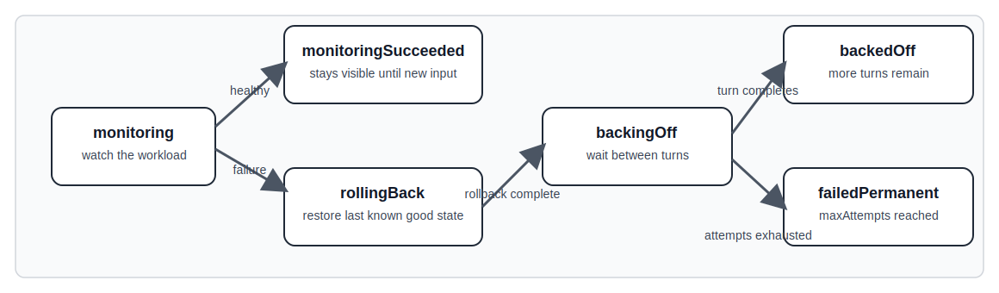

# Rollback Backoff

Rollback backoff is the retry window the controller uses after a workload resize does not stay healthy. It gives the workload time to settle, then when there is a failure after the resize, the controller enters `rollingBack` and restores a last known good state, which is either the last recorded successful resource settings or the original resource setting defined by the manifest. After rollback is complete, the controller moves to `backingOff` and waits before the next attempt. Backoff retries for a configured number of turns if the same recommendation that failed initially still applies. Rollback ends in `failedPermanent` when retries are exhausted.

## Prerequisites

Rollback functionality requires a `RollbackPolicy` (namespaced) or `ClusterRollbackPolicy` (cluster-scoped) that matches your workload.

**Important**: Without a matching rollback policy, the controller will not monitor, rollback, or retry failed resizes. The rollback mechanism is disabled by default until you create a policy.

See [Rollback Policies](./Rollback-Policies.md) for field references, configuration examples, and setup instructions.

## Rollback Flow

The diagram below shows the complete rollback lifecycle, from monitoring through backoff to terminal states:

## Expectations

### 1. Monitoring starts

When the controller applies a rollback recommendation, the owner enters `monitoring`.

What you will see:

- the rollback state annotation is written to the owner
- the policy selection fingerprint is recorded
- the controller watches the workload for health or failure signals

### 2. Monitoring succeeds

If the workload stays healthy through the monitoring window, the owner moves to `monitoringSucceeded`.

What you will see:

- the monitoring result stays visible in the rollback state annotation
- the policy selection fingerprint remains recorded
- the owner stays in this stable success state until a new recommendation or failure appears

### 3. A failure starts a rollback turn

If the workload fails during monitoring, the owner moves to `rollingBack`.

What you will see:

- the failure reason and message are stored
- rollback recommendations are written to the owner
- the rollback phase is visible before the backoff window starts

### 4. Rollback completes and backoff begins

After the rollback is applied, the owner moves to `backingOff`.

What you will see:

- the current turn is recorded
- a new expiry time is calculated from `timePeriod * multiplyByTurn * turn`

### 5. The turn completes or expires

When the backoff window expires, the controller checks whether another turn is allowed.

- if more turns remain, the owner moves to `backedOff` and the next turn can start later if the same fingerprint appears again
- if no turns remain, the owner moves to `failedPermanent`

### 6. The state is cleaned up per turn

Rollback recommendation annotations are cleared when a turn completes.
The history stays in the rollback state annotation, so operators can see what happened without leaving stale recommendation annotations behind.
If the same recommendation fingerprint appears again after the prior turn completed, the controller treats it as a fresh turn.

## Operational Expectations

- `monitoringSucceeded` means the workload stayed healthy through the monitoring window
- `rollingBack` means the controller is actively restoring the last known good state after a failure
- `backingOff` means the controller is waiting for the current retry window to expire
- `backedOff` means the backoff turn completed successfully and the controller is ready for a future retry if needed
- `failedPermanent` means the controller will not keep retrying this rollback path for the current policy state

## Tuning Guidance

- Use a small `timePeriod` when you want fast retries after a brief disruption
- Increase `multiplyByTurn` when later retries should wait longer than earlier retries
- Set `maxAttempts` low when you want the controller to stop after a small number of retries

## Common Pitfalls

- forgetting to create a `RollbackPolicy` or `ClusterRollbackPolicy` - without a matching policy, rollback functionality is completely disabled
- setting `maxAttempts: 1` means the first expired backoff is terminal
- using a very short `timePeriod` can cause frequent retries on noisy workloads
- forgetting that the current turn number affects the wait time can make later retries feel slower than expected

## Event Signals

The controller emits events for the main transitions:

- rollback monitoring started
- rollback monitoring succeeded
- rollback rolling back started
- rollback backoff turn completed
- rollback backoff exhausted
- rollback state cleared because no policy resolved

## Related Documentation

- [Rollback Policies](./Rollback-Policies.md) - Field reference and examples for RollbackPolicy and ClusterRollbackPolicy
- [Policy Configuration](./Policy-Configuration.md)
- [Troubleshooting](./Troubleshooting.md)
- [FAQ](./FAQ.md)
